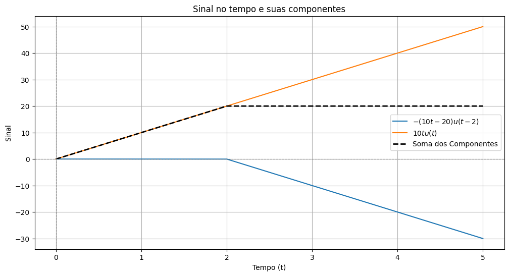

# Gerador de PWL
Ferramenta para plotar sinais e suas componentes, sendo estes descritos por funções degrau.
Pode ser utilizado para estudo de sinais e sistemas, assim como para análise de circuitos elétricos.

O [arquivo ipynb](./Gerador_de_PWL_2_0.ipynb) pode ser baixado e executado em ambiente local, ou pode ser aberto diretamente no Google Colab.
[](https://colab.research.google.com/github/armandokeller/gerador-pwl/blob/main/Gerador_de_PWL_2_0.ipynb)

# Como utilizar

## Instalar as bibliotecas e realizar as importações necessárias

Execute a primeira célula para instalar a biblioteca [lcapy](https://github.com/mph-/lcapy) e executar a importação de todas as bibliotecas necessárias. Estas já vem instaladas por padrão nas instâncias do Google Colab, caso esteja executando em outro ambiente, verifique se elas estão instaladas.

## Definir o sinal e os parâmetros do gráfico

Na segunda célula é necessário definir alguns parâmetros do gráfico, como tempo de duração (tamanho do eixo do tempo), quantidades de pontos utilizados na avaliação da expressão, nome do arquivo a ser exportado e a expressão do sinal.
O trecho abaixo mostra um exemplo onde o sinal é exportado para um arquivo "sinal.txt", o eixo do tempo tem tamanho 5, e são utilizados 100.000 pontos para gerar o gráfico.
O sinal definido em _expressao_ é $10\cdot t \cdot u(t) - 10(t-2)u(t-2)$, que é composto por uma rampa que começa em $t=0$ e outra que começa em $t=2$.

```python
nome_arquivo = "sinal.txt"
tempo_final = 5
pontos = int(100e3)

# Expressão do sinal a ser analisado. Variáveis simbólicas 't' e função degrau 'u(t)' são usadas, a rampa pode ser escrita como t*u(t)
expressao = 10*t*u(t)-10*(t-2)*u(t-2)
```

## Plotar o gráfico
Na terceira célula é possível ajustar quaisquer parâmetros necessários na formatação do gráfico, assim como [adicionar anotações](https://matplotlib.org/stable/users/explain/text/annotations.html).
Um exemplo de gráfico gerado pode ser visto abaixo, onde temos o sinal completo e cada uma das suas componentes.



## Exportar sinal para utilização em outros programas

Na quarta e última célula, é realizada a exportação do gráfico para um arquivo txt. Este arquivo pode ser utilizado para plotar o gráfico em qualquer outro software, assim como pode ser importado como PWL em simuladores de circuitos elétricos como o LT Spice [Documentação do LT Spice](https://www.analog.com/en/resources/technical-articles/ltspice-importing-exporting-pwl-data.html), ou até mesmo ser utilizado em geradores de funções arbitrárias.

# Contribuições

Este projeto foi desenvolvido para demonstrações durante as aulas de análise de circuitos no domínio de frequências, caso tenha alguma sugestão de melhoria sugestões são bem vindas.
